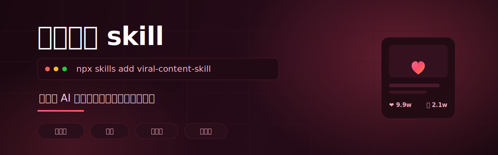

<div align="center">



<h1>viral-content-skill · 爆款内容 skill</h1>

<p><b>让你的 AI 写出真正能爆的中文社媒内容</b><br/>小红书 · 抖音 · 视频号 · 公众号</p>

<p>
<a href="https://github.com/EA-Studio-SHARK/viral-content-skill/stargazers"></a>


</p>

<p>
<a href="#安装"><b>安装</b></a> ·
<a href="#before--after"><b>效果对比</b></a> ·
<a href="#核心规则预览"><b>核心规则</b></a>
</p>

</div>

---

`viral-content-skill` 是给 Claude Code、Cursor、Codex 等 AI Agent 用的中文社媒内容技能包，覆盖小红书、抖音、视频号、公众号，让 AI 不再只会写平庸文案，而是按平台算法、钩子、痛点开头、互动结尾来创作。

## 安装

```bash
npx skills add EA-Studio-SHARK/viral-content-skill
```

## 覆盖平台

小红书 / 抖音 / 视频号 / 公众号。

## Before / After

主题：减脂餐

Before：

```text
今天给大家分享一个减脂餐做法。准备鸡胸肉、西兰花和玉米，把鸡胸肉煎熟，西兰花焯水，玉米蒸熟，搭配起来就可以吃了。这个减脂餐热量比较低，适合减肥期间食用。
```

After：

```text
🥗 这份减脂餐我连吃7天，腰围小了2cm！

姐妹们，减脂期最崩溃的不是饿，是吃得像受刑😭

但这份真的不一样：
鸡胸肉煎到焦香，西兰花保留脆感，再加半根玉米，饱腹感直接拉满。

✅ 高蛋白
✅ 低油低盐
✅ 10分钟搞定
✅ 上班带饭也不难吃

封面大字：减脂期别再水煮菜了！

想要我整理一周减脂餐菜单的，评论扣1。
记得收藏，不然下次真的找不到！

#减脂餐 #减脂食谱 #一人食 #上班带饭 #低卡晚餐 #健康饮食 #减肥打卡
```

## 核心规则预览

- 标题必须有钩子：好奇、利益、反差、身份认同至少占一个。
- 前3秒或前1句直接戳痛点或抛悬念，不要铺垫。
- 用“你”写出对话感，让用户觉得“这就是在说我”。
- 内容必须具体到场景、数字、动作，不写抽象空话。
- 结尾必须引导互动：评论、收藏、转发、关注。

## 更多起号实战

用这个 skill 批量起号、做矩阵的实战玩法，B站教程 + 创作者交流群即将上线。
关注作者获取更新：[EA-Studio-SHARK](https://github.com/EA-Studio-SHARK)

## License

MIT
